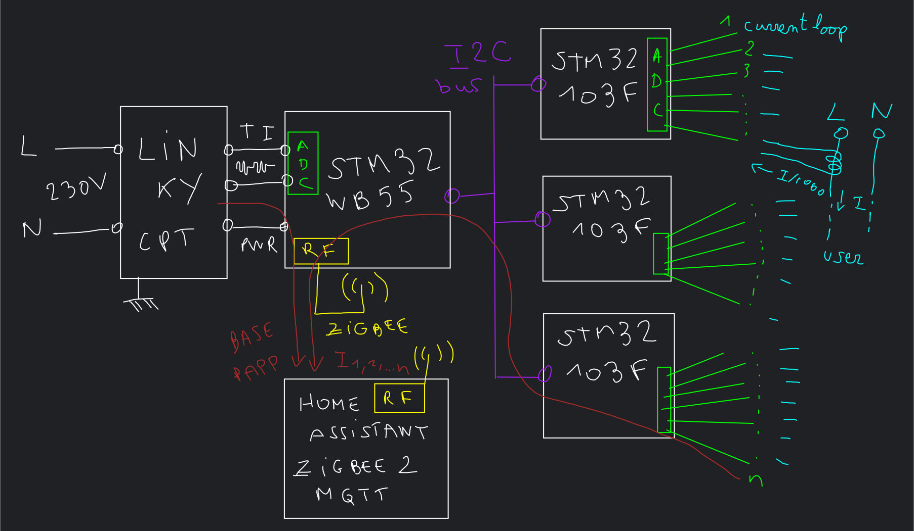

# a complete energy monitoring tool for my Linky and my electric board

The idea is to use cheap STM32 modules to tap TI data from the linky (BASE + PAPP) and also each distribution line (intensity).
As the STM32WB55 is good for RF (Zigbee, cf. my other repo), and the blue pill (STM32F103) good for ADC (ten inputs per chip), my idea is to let blue pills do the job and collect it with I2C (using a master / multi-slave topo). The troughput of I2C is poor, but enough to fetch 10 measures on a few chips every second. It's cheaper in wiring than SPI (2 wires vs 4 or 5 if you want a dedicated GPIO for slave select).

So the overall idea :

I drew 3 blue pills, but I plan to use one per row from my board (so ... a lot, 12 ?) as I plan to tap all the lines from my home.

To make some apparent power consumption calculation, I would also need to tap the tension (230V AC) with the same phase shift as the current loops, so through a same circuit as used for currents.

[Design folder](./design/README.md) explain how to tap intensity (RMS calculation).