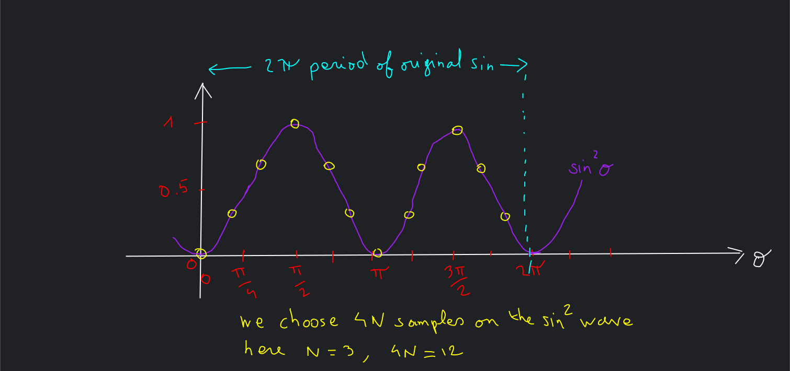
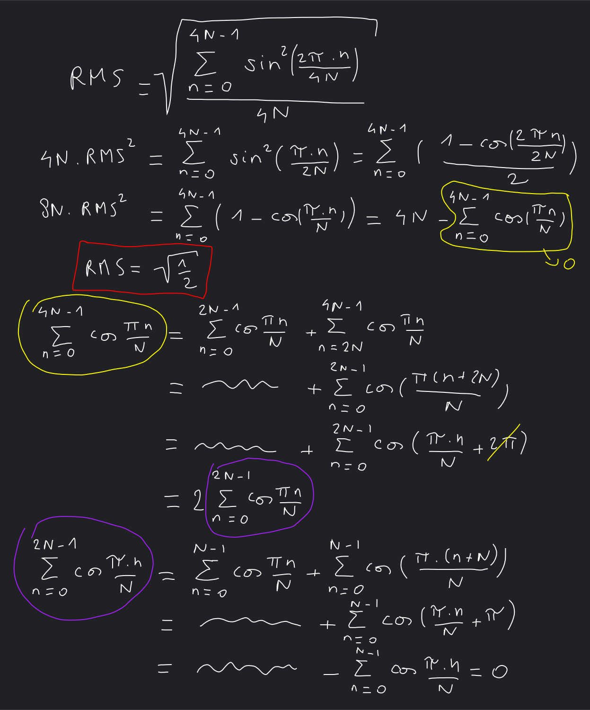

# Take any sample you want on a sin wave to calculate its RMS value, it will be fine, and equals to sqrt(1/2)... magic !

I noticed that when dealing with a sinusoidal wave from which you want to have a hint on its RMS (amplitude), you can choose any number of points (starting with 3) equally spaced, and get a very good idea of the RMS of the sin wave. I made a program to check so, and it works. So I wonder how I had always miss that beautiful property of sinus. So a bit of math to convince myself. If you already know about "the sum of the roots from unity is null", then you have the analogy.

### First as you know the RMS formula (for Root Mean Square) is the square root of the mean of the square values.

$\text{RMS} = \sqrt{\frac{1}{n} \sum_{i=1}^{n} x_i^2}$

### Second, a bit of trigo

If $x_i$ if sin(x), another way to formulate $sin^2$ is $\frac{1-cos(2x)}{2}$

With a quick drawing it's king of straightforward (no need of Euler, here)

As you see, the mean of $sin^2$ is 0.5 (blue line), so RMS is $\sqrt{1/2}$

So how many samples do you need to get the value (0.707...) with a given precision... In fact it doesn't matter.

### Third, the principle

To simplify the demonstration, let's say we will choose a power of 4 samples on the sin wave (at least). As I plan to measure my 50Hz current with a 1MSPS ADC, do not be cheap of a fair number of samples (but it works with 3...)

### Fourth, the proof

We will need two more trigo tricks (easiers this time)

$cos(x+2.\pi) = cos(x)$ for the yellow bloc

$cos(x+\pi) = -cos(x)$ for the purple bloc

It also works if you don't start from 0 (you can add an offset). For a more general proof, we will need to take the real part of the Euler $e^{i\theta}$ and use a geometric series to find 0.

Let $\theta = e^{\frac{2 i \pi }{N}}$, so $\theta^N = 1$.

The geometric series worth : $1 + \theta + \theta^2 + \ldots + \theta^{N-1} = \frac{\theta^N-1}{\theta-1}$ , so 0

If the sum works in complex space, it also works on real space (projection, so with cosinus)