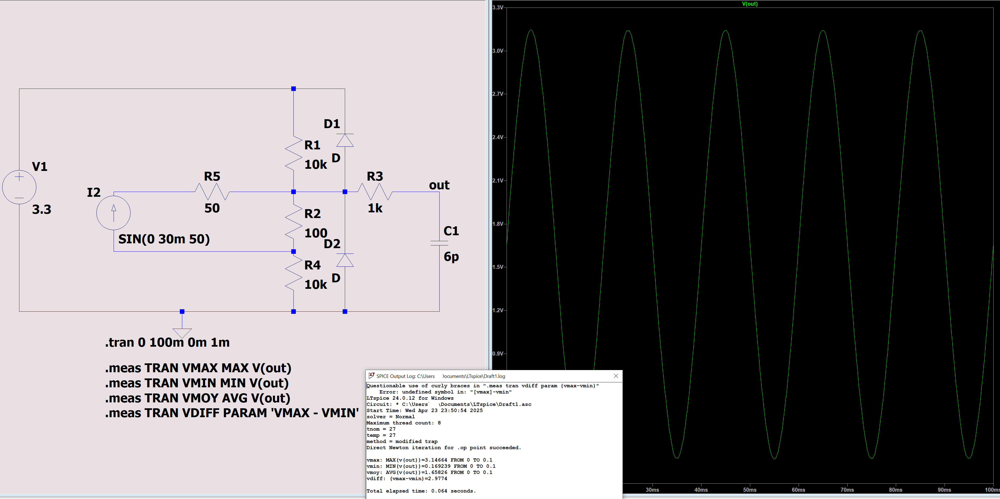

# Schematic for ADC current acquisition

I use a current loop on my Line departure from electric board. The model is "Current Transformer ZMCT103C" for aliexpress (1:1000 transfo).

I simulate the circuit to feed my STM32F103 ADC, below :

First with a 1A (amplitude) current converted to 1mA by the transformer (the coil). The generated current will feed a $100\Omega$ resistor on a 21k total scale. The voltage catch by the ADC will be around 0.1V peak-to-peak (easy)

For 10A, it's linear :

Also for 30A :

But for more (here 50A), it saturates and the protection diode will take action to save the adc.

N.B. : $1k\Omega$ and 6pF are from STM (the capacitor will be always full regarding 50Hz signal, so those values are not important for out use case).

N.B. 2 : as the average value will slightly change depending on the intensity, and as I don't want to introduce additional phase shift (I do not use DC capacitor), the program will have to compute a mean value before calculating RMS. Okay, I have plenty of time.

N.B. 3 : No phase shift, cause I want to tap the 230V voltage too to calculate the apparent power, later (P=U.I, or on one second let's say : $\int_0^1 u(t) \cdot i(t) \, dt$. And it will be through the same current loop way to get the same phase shift (if any bring by the coil... sure it will be). The linky is supposed to do so, we will check.
